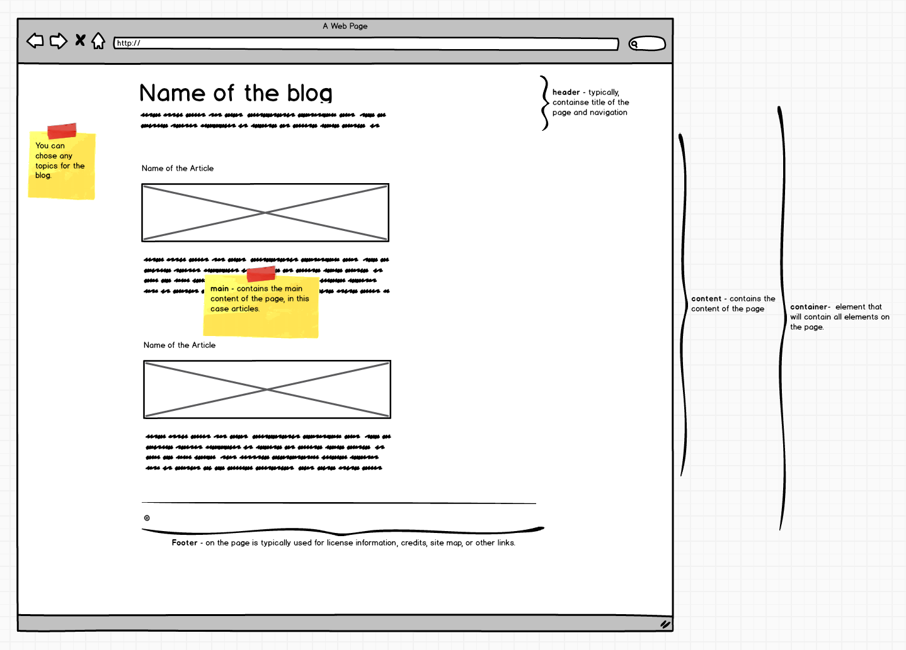

# HTML/CSS Project

## Introduction

- The idea is to build a personal portfolio, that you can use in the future adding all the projects you will do in this amazing course
- Here an [example](https://kristiinacwalina.github.io/)

## Steps

The page should **NOT** use any framework like Bootstrap.

### Step 1

- Fork and clone this repository

It should include the following elements:

- The `.html` page and a linked `.css` file applies a consistent color scheme to links and text on your page.
- A page header with a title and description for the site.
- A projects section with three projects, each including a title, summary and a link.

### Step 2

- A page footer containing info about you or the site.
- Proper use of the semantic HTML tags we discussed.
- Research the `:first-child` pseudo-class and use it to style the first article so that it stands out from the others.
- **Commit often (with good meaningful commit messages), and Push to Github regularly.**
- Use the sketch below to guide you towards the layout and content you are trying to achieve. _Please note that this is just a sketch - you can choose the colours, fonts and images that you want to use in the page._

  
  
  ### Step 3
  
- Rename your repository to your-user-account.github.io and follow [these instructions](https://migracode-barcelona.gitbook.io/syllabus/guides/git#how-to-publish-your-website-in-githubio) to make it public How to publish with github.io
